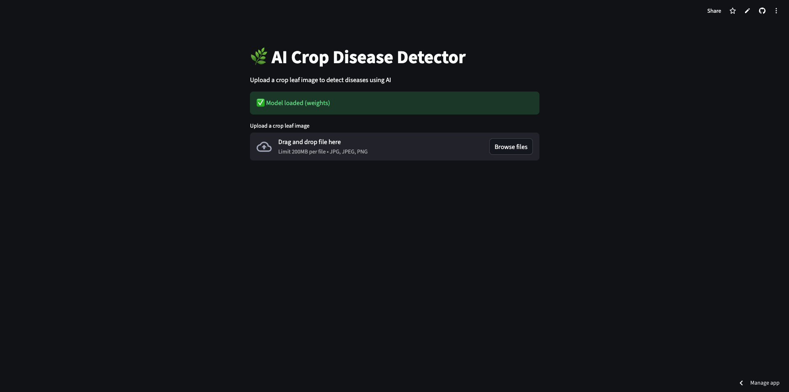
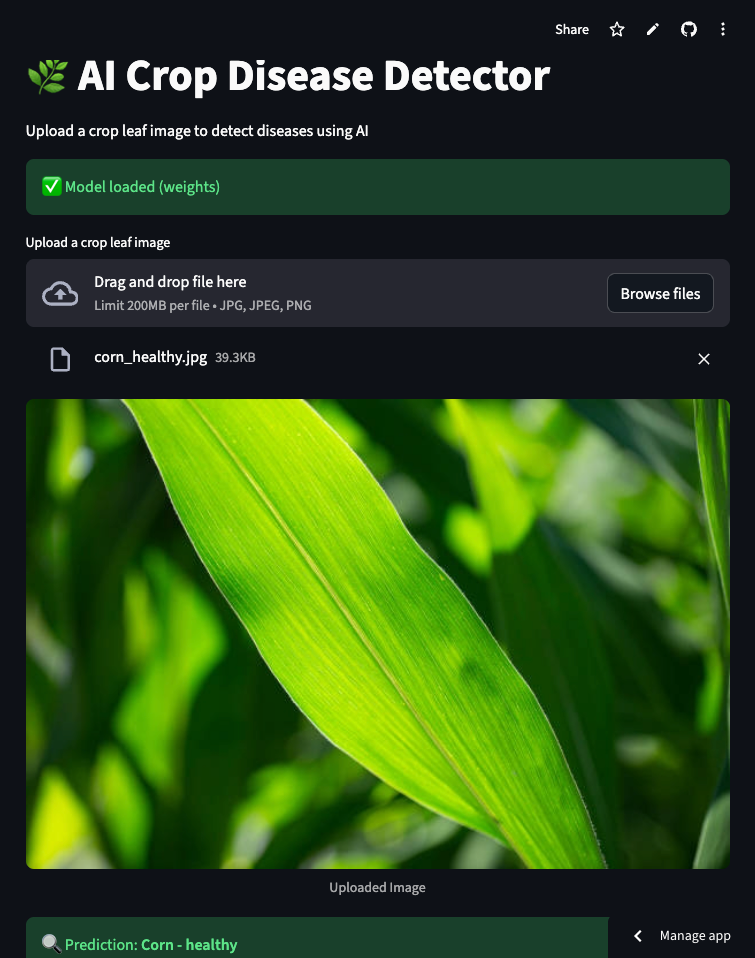
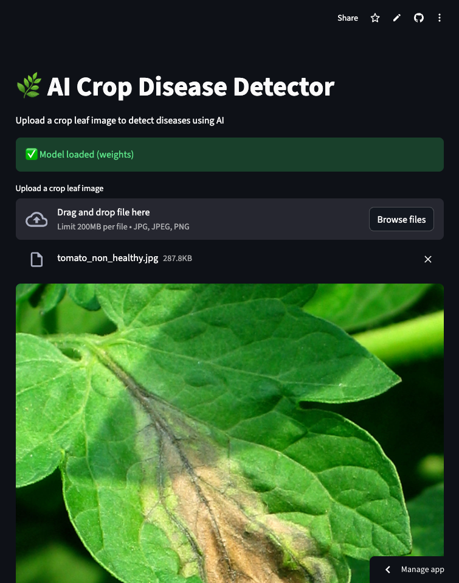

# 🌿 MobilePlantViT - AI Crop Disease Detector

AI-powered crop disease detection system designed for smallholder farmers in Latin America. This deep learning solution uses MobileNetV3Small to detect plant diseases from images, enabling accurate diagnostics for agricultural applications.

## 🎯 Project Overview

Agriculture remains the backbone of rural economies, especially in the Global South where it employs over 65% of the workforce in some developing regions. Farmers face unpredictable losses due to pests, disease, and climate volatility, contributing to food insecurity affecting an estimated 2.3 billion people globally.

This project addresses these challenges by providing:
- **High accuracy** - 97.13% test accuracy on PlantVillage dataset
- **Easy model management** - Simple load and save functionality for trained models
- **Streamlit interface** - User-friendly web interface for predictions
- **Reproducible training** - Complete training pipeline in Jupyter notebook

## 📊 Model Performance

- **Test Accuracy**: 97.13%
- **Test Loss**: 0.102
- **Architecture**: MobileNetV3Small (transfer learning from ImageNet)
- **Dataset**: PlantVillage (multiple crop diseases)
- **Input Size**: 160×160 pixels

## 🏗️ Architecture

The model uses a transfer learning approach with MobileNetV3Small as the backbone:

- **Base Model**: MobileNetV3Small (ImageNet pretrained, frozen during head training)
- **Head Architecture**:
  - Global Average Pooling
  - Dropout (0.1)
  - Dense layer (256 units, no bias)
  - Batch Normalization
  - Swish activation
  - Dense output layer (softmax)

**Best Hyperparameters** (found via Bayesian optimization):
- Dense units: 256
- Dropout: 0.1
- Activation: Swish
- Learning rate: 0.001
- Weight decay: 1.9e-5
- Data augmentation: Disabled (best performance without it)

## 📁 Project Structure

```
MobilePlantViT/
├── notebooks/
│   └── 01_model_training.ipynb          # Complete training pipeline
├── streamlit_app/
│   ├── app.py                           # Streamlit inference interface
│   └── model/
│       ├── best_model_tuned.weights.h5  # Saved model weights
│       └── class_names.json             # Class labels
├── docs/
│   └── images/                          # Demo screenshots
├── pyproject.toml                       # Dependencies
├── poetry.lock                          # Locked dependency versions
└── README.md                            # This file
```

## 🚀 Quickstart

### Prerequisites

- Python 3.11-3.13
- Poetry (for dependency management)

### Installation

1. Install dependencies:
   ```bash
   poetry install
   ```

2. Activate the environment:
   ```bash
   poetry shell
   ```

3. Launch Streamlit demo:
   ```bash
   streamlit run streamlit_app/app.py
   ```

## 🎬 Demo

The Streamlit application provides an intuitive interface for crop disease detection. Here are some examples of the app in action:

### Upload Interface

The app features a clean, user-friendly interface for uploading crop leaf images:



*The upload interface allows users to drag and drop or browse for images of crop leaves. The model status indicator confirms when the AI model is loaded and ready for predictions.*

### Healthy Leaf Detection

When a healthy leaf is uploaded, the model correctly identifies it:



**Example Result:**
- **Prediction**: Corn - healthy
- **Confidence**: 55.98%

*The model successfully identifies healthy corn leaves with appropriate confidence scores.*

### Diseased Leaf Detection

The model excels at detecting various plant diseases:



**Example Result:**
- **Prediction**: Tomato - Late blight
- **Confidence**: 99.38%

*The model accurately detects late blight disease on tomato leaves with high confidence, enabling early intervention for farmers.*

### Features

- **Real-time predictions** - Instant disease classification upon image upload
- **Confidence scores** - Transparent probability scores for each prediction
- **All class probabilities** - View probabilities for all possible disease classifications
- **Multiple crop support** - Detects diseases across various crop types (corn, tomato, apple, etc.)

### Training the Model

The complete training pipeline is in `notebooks/01_model_training.ipynb`. The notebook includes:

1. **Dataset Loading**: PlantVillage dataset via TensorFlow Datasets
   - 70% training, 15% validation, 15% test split
   - Image preprocessing with MobileNetV3 normalization
   - Efficient tf.data pipeline with caching and prefetching

2. **Model Training**:
   - Transfer learning with frozen MobileNetV3Small backbone
   - Mixed precision training (float16) for faster GPU training
   - Warmup + cosine learning rate schedule
   - Early stopping and model checkpointing
   - TensorBoard logging

3. **Hyperparameter Tuning**:
   - Bayesian optimization with Keras Tuner
   - Searches over architecture and training hyperparameters
   - 10 trials to find optimal configuration

4. **Model Saving**:
   - Save trained model weights (`.h5` format)
   - Save full model (`.keras` format)
   - Export class names for inference

5. **Evaluation**:
   - Test set evaluation
   - Confusion matrix visualization
   - Classification report (precision, recall, F1-score)

## 🔧 Technical Details

### Training Configuration

- **Framework**: TensorFlow/Keras
- **Mixed Precision**: Enabled (float16) for GPU acceleration
- **Optimizer**: AdamW with weight decay
- **Learning Rate Schedule**: WarmupCosine (1 epoch warmup + cosine decay)
- **Batch Size**: 32
- **Image Size**: 224×224 (training), 160×160 (inference)
- **Data Augmentation**: Random flips, rotations, zoom, contrast (optional)

### Dataset

- **Source**: PlantVillage dataset (via TensorFlow Datasets)
- **Classes**: Multiple crop diseases (e.g., Tomato Yellow Leaf Curl Virus, etc.)
- **Format**: RGB images with disease labels
- **Preprocessing**: MobileNetV3-specific normalization

## 💾 Model Loading and Saving

The project provides straightforward model management:

- **Saving Models**: Models are saved in the notebook using:
  - `model.save_weights("best_model_tuned.weights.h5")` - Saves weights only
  - `model.save("best_model_tuned.keras")` - Saves full model (architecture + weights)
  
- **Loading Models**: The Streamlit app loads saved weights:
  - Loads weights from `streamlit_app/model/best_model_tuned.weights.h5`
  - Rebuilds model architecture to match training configuration
  - Loads class names from `streamlit_app/model/class_names.json`

- **Streamlit App**: Web-based interface for quick testing and inference

## 🔮 Future Work

- Fine-tune on region-specific diseases and crops for Latin America
- Incorporate active learning to allow users to submit new disease samples
- Add local language advisory and treatment suggestions
- Integrate into field extension workflows
- Support for additional crop types and diseases
- Add model versioning and experiment tracking

## 📝 Notes

- Model training requires GPU for reasonable training times (~1 hour for hyperparameter tuning)
- The Streamlit app loads the trained model weights for inference
- Models are saved in standard Keras formats (`.h5` for weights, `.keras` for full model)
- All training code is in the Jupyter notebook for reproducibility
- Ensure model architecture matches when loading weights (defined in `streamlit_app/app.py`)

## 📚 References

1. MIT News – ["Reducing pesticide use while increasing effectiveness"](https://news.mit.edu/2024/reducing-pesticide-use-while-increasing-effectiveness-agzen-0312)

2. DevelopmentAid – ["Smart agriculture in Latin America"](https://www.developmentaid.org/news-stream/post/184774/smart-agriculture-in-latin-america)

3. Google Public Policy – ["How Wadhwani AI is helping farmers reduce food waste with AI"](https://publicpolicy.google/article/wadhwaniai-ai-farmers-agriculture-food-waste/)

4. EurekAlert – ["Machine learning helps Colombian farmers improve maize yields"](https://www.eurekalert.org/news-releases/825095)

5. Tufts Digital Planet – ["Getting Real About AI for the Bottom of the Pyramid"](https://digitalplanet.tufts.edu/getting-real-about-ai-for-the-bottom-of-the-pyramid/)

## 👤 Author

Juan Esteban Rozo Urbina | Bogota, Colombia 🇨🇴
